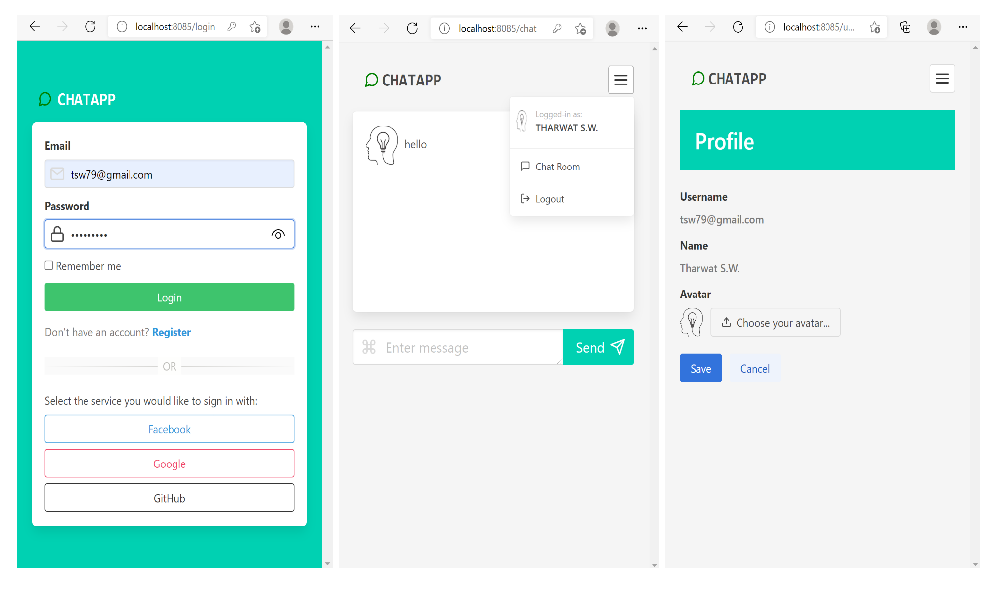

  

# ChatApp - A Go chat application

A simple web-based chat application that allows real-time communcation between multiple users.

## General info

This project was developed in Go, utilizing its standard library to run a web server. 